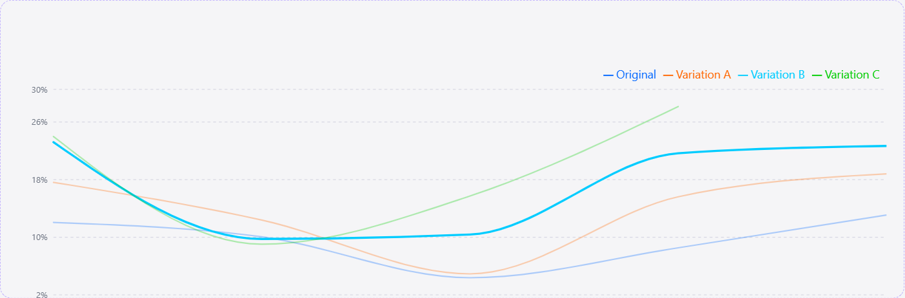

# Test Assignment: Interactive Line Chart




## Библиотека визуализации: Recharts 

## Реализованные функции

- График конверсии в процентах для всех вариаций
- Переключение между day-week
- Выбор стиля: Line, Smooth, Area
- Выбор видимых вариаций 
- Адаптивная верстка

## Бонусные функции

- Экспорт графика в PNG

## Технологии

React + TypeScript + Recharts + CSS Modules

## Установка

```bash
npm install
npm run dev
```

## Деплой

```bash
npm run deploy
```


